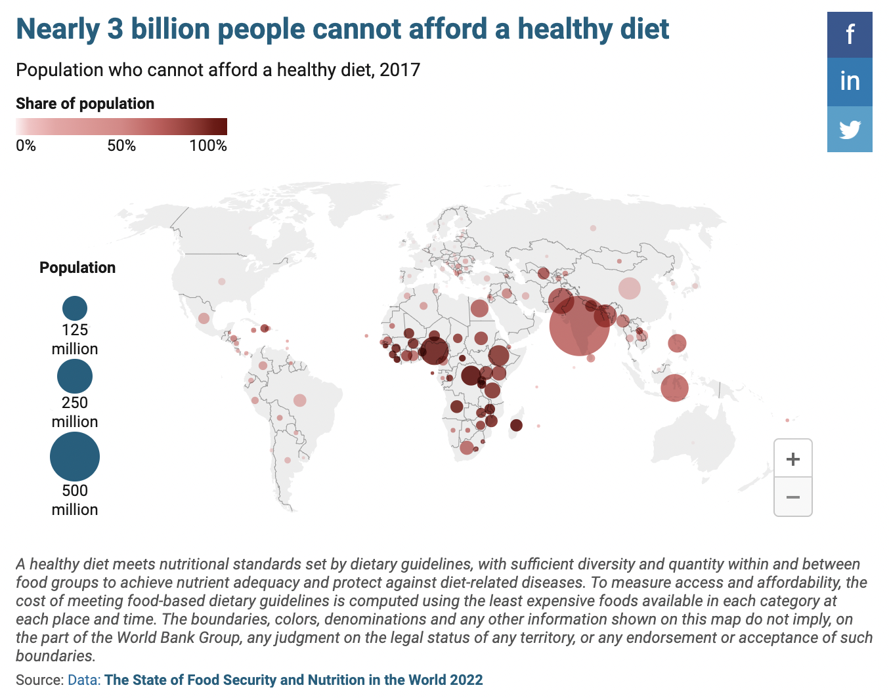
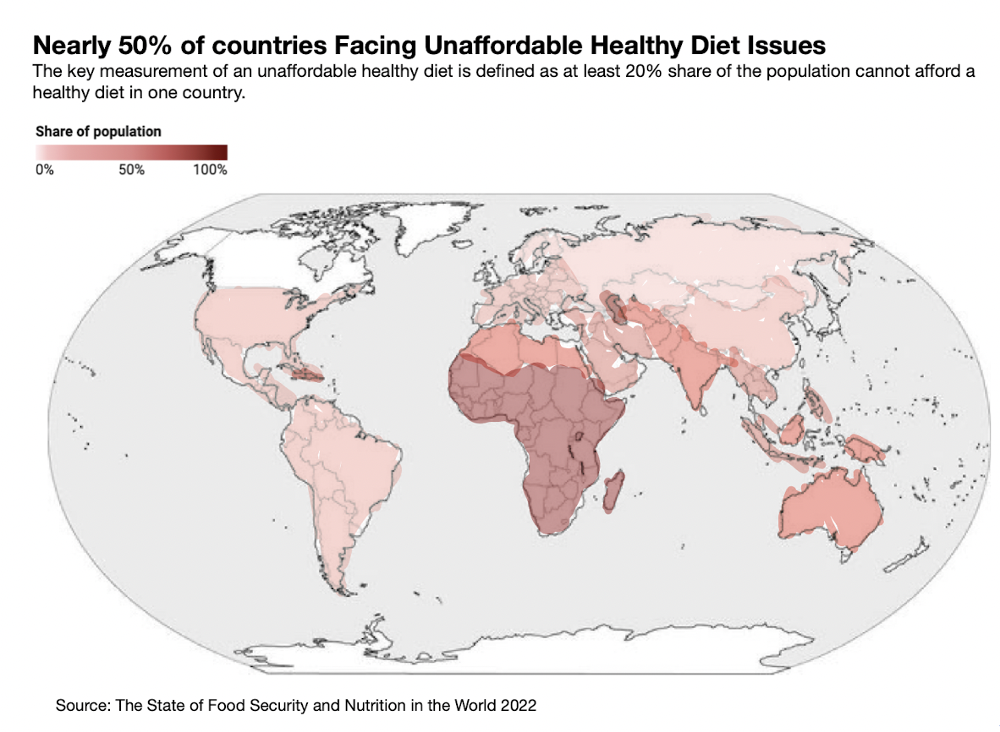
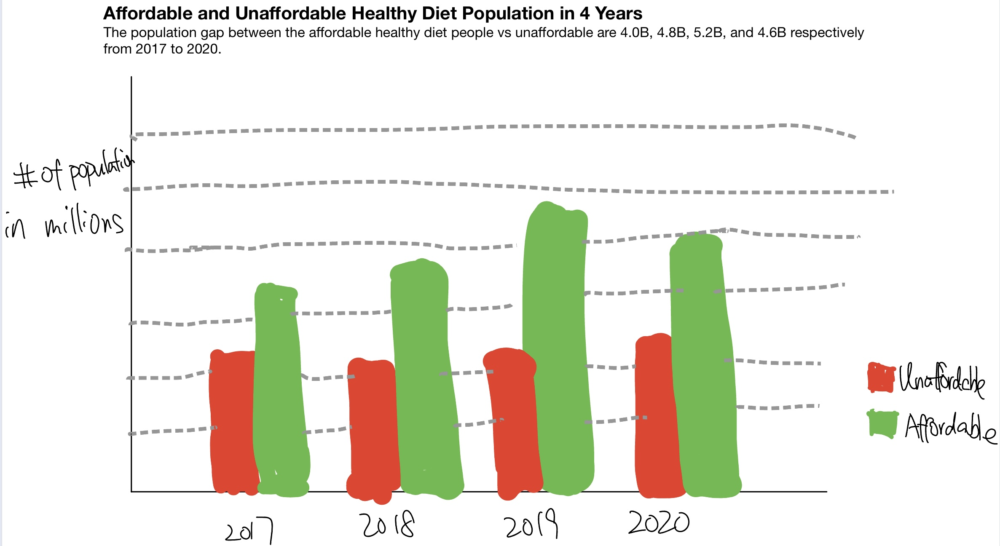

| [Home Page](https://yicenma.github.io/tswd-portfolio) | [In-Class Week3](Week3-in-class.md) |  [Visualizing Debt](visualizing-government-debt) | [Critique by Design](critique-by-design) | [Final project I](final-project-part-one) | [Final project II](final-project-part-two) | [Final project III](final-project-part-three) |

#  Critique by Design

## Step one: Find a data visualization

I found the data visualization from the world bank organization’s official website. The organization's main goal is to reduce poverty and promote sustainable economic growth in the poorest countries of the world. They covered programs cover a wide range of areas, including agriculture, education, energy, health, and infrastructure development. I found the brief named ”Food Prices for Nutrition DataHub: global statistics on the cost and affordability of healthy diets“, which highlights there is a huge group of people who cannot afford a healthy diet in the world. I think this topic is special because it is related to every human being and can alert people/organizations of the diet crisis of the world. However, the visualization’s story cannot illustrate the purpose and might confuse the audience. So, I decided to use two visualizations to improve it.

The original visualization is shown below:

Website: https://www.worldbank.org/en/programs/icp/brief/foodpricesfornutrition

## Step two: Critique the data visualization

### Ranking(1-10 from lowest to highest):

Usefulness: 5

Completeness: 8

Perceptibility: 3

Truthfulness: 10

Intuitiveness: 4

Aesthetics:7

Engagement: 6

### Describe your overall observations about the data visualization here.  What stood out to you?  What did you find worked really well?  What didn't?  What, if anything, would you do differently?  

First of all, the visualization’s title stood out to me. By looking at the title itself, I can clearly understand the purpose of the viz, highlighting a large portion of the world population who cannot afford a healthy diet. It also demonstrates the data usage by applying the data into a viz tool. The visualization is interactive, the audience can put the cursor on the region and it will display the percentage of a country’s population that cannot afford healthy diets. It also uses circles on the world map to represent each country’s unaffordable population size. However, some circles overlap which messes up the visualization. The audience might think there is no data on that country when some circles are too small which is hard to see. This visualization only uses three different circle sizes to represent population size so it is hard to compare the real population on the map. Moreover, the author tries to utilize the sequential red color in the circle to represent the percentage of people that cannot afford healthy diets for each country, which is good. Darker red means a higher unaffordable percentage. However, in some countries, there are many people that cannot afford healthy diets compared to other countries but it’s only a small portion of that country’s population (for example India). I would like to just use one metric for the visualization so it won’t confuse people. I would use percentages to represent each country to eliminate confusion. Each country is governed by its own laws and rules. If we want to let more people have a healthy diet, we should encourage the governments to solve this problem and make sure more people can afford healthy diets. So the unaffordable percentage is a better choice than the population. It will also make the visualization more intuitive and perceptible.

### Who is the primary audience for this tool?  Do you think this visualization is effective for reaching that audience?  Why or why not?

The primary audiences for this visualization are:
1. Nonprofit organizations, private sector entities, governments, civil rights organizations, and charity groups who care about this issue
2. People in the World Bank member countries that want to know more about the affordability of healthy food in their countries
3. Specialist who focuses on food prices for the nutrition and regions database study
4. People who need the data hub to analyze food prices for nutrition around the world.

This visualization is effective if the audience can take some time to comprehend the graph. Then, they can understand and compare each country’s unaffordable healthy diet portion and size by color and shape. As I mentioned above, the main problem is the contrast between the population circle size and the red color, which will confuse the audience (India). Because it is only a brief page of the Food Prices for Nutrition DataHub, the audience might just take a glance at the page. Making an intuitive and engaging visualization about the datahub application is more useful for the audience.

### Final thoughts: how successful what this method at evaluating the data visualization you selected? Are there measures you feel are missing or not being captured here?  What would you change?  Provide 1-2 recommendations (color, type of visualization, layout, etc.)

This evaluation form works well for me because it evaluates the visualization from multiple aspects. There is one thing I think is missing is the weight of each aspect, because based on the purpose of each visualization and its target audience, the weight of the measurement should be different. For example, in my selected visualization, I think truthfulness, perceptibility, and intuitiveness are more important than other measurements.  Then we can compute a final score based on their weight to evaluate the visualization.
Moreover, I will change each measurement title to bold and put it in a single line and put other descriptions in the next paragraph with a smaller font size to make it clear. Also, we can utilize the diverging colors (red to green) to represent the measurement as a rating from negative to positive and make it more intuitive.

## Step three: sketch out a solution

I sketch my solution into two visualizations. The data are downloaded from the original datahub.

## Step four: Test the solution

I have shown my visualizations to two different people and asked for their feedback shown below. One is my classmate and the other is the general audience.

### First VIZ

**Can you tell me what you think this is?**
* It shows the percentage of people that cannot afford healthy diets in each country
* It shows the percentage of people that cannot afford healthy diets in each country, and the darker color means a more severe crisis.

**Can you describe to me what this is telling you?**

* Africa region is facing the most severe unaffordable healthy diet issue.
* Unaffordable healthy diet is severe around the world.
* The developed countries have more percentage of people that can afford healthy diets.  This percentage is related to the country’s economic and civil situation.

**Is there anything you find surprising or confusing?**

* One thing that surprised my audience is that most of the countries in the world are facing the unaffordable healthy diet issue.
* The legend confused my audience because she initially thought it was the worldwide percentage. After taking some time to comprehend the graph, she realized it is the percentage of each country’s legend.
* One surprising point is why Canada is blank.
* The other counties’ colors are not differentiable when the percentages are close (ex. China and Russia)

**Who do you think is the intended audience for this?**

* The leader of each country who should care about this crisis.
* Charitable organizations/non-profit organizations that are trying to fundraise to make healthy diets affordable to all people in the world. 

**Is there anything you would change or do differently?**
* Change the title of the legend to a more specific one, such as “the population percentage facing unaffordable health diet for each country”.
* Not doing this visualization by hand and there is some overlapping/not covered region on the map.
* Recommended to list the top 10 countries with the most severe diet issue.

### Second VIZ

**Can you tell me what you think this is?**
* It tells the two categories’ population change from 2017 to 2020.
* It shows the gap between the affordable and unaffordable healthy diet population.

**Can you describe to me what this is telling you?**

* There is no change/almost no change in the unaffordable population worldwide.
* The gaps between the two category seem to decrease gradually each year.

**Is there anything you find surprising or confusing?**

* The surprising point is why the affordable population decreased in 2020.
* There is no unit on the y-axis.
* There is no way to know the exact number of each bar.
* Cannot tell the population difference between each year.
* It is surprising that there is a huge amount of the population who cannot afford a healthy diet.

**Who do you think is the intended audience for this?**

* Everyone could be the audience because the unaffordable healthy diet issue is related to every human being. People could track the trend on this graph.
* Charitable organizations/non-profit organizations that are trying to fundraise to make healthy diets affordable to all people in the world. 

**Is there anything you would change or do differently?**

* Label the number of the population for each year.
* Changing it to a more trackable chart that allows the audience to easily detect the differences.
* Label the number of the population for each year to make the graph clear.

## Step five: Build your solution

### Revision based on interview and self-critiques

There are many people that cannot afford healthy diets compared to other countries but it’s only a small portion of that country’s population, which is the contrast between the circle shape(size of population) and color.

**Solution:** Choose one metric(percentages) for the visualization so it won’t confuse people. If we want to let more people have a healthy diet, we should encourage the governments to solve this problem and make sure more people can afford healthy diets. So the unaffordable percentage is a better choice for the audience.

The legend shape size makes it the audience hard to compare each color.

**Solution:** Use the sequential color legend to represent the percentage. Also, make it interactive so the audience can put the cursor on the region and it will display the percentage of a country’s population that cannot afford healthy diets.

Hard to detect where are the 3 Billion population comes from by the graph.

**Solution:** Change the title to more engaging to highlight the purpose - an unaffordable healthy diet crisis around the world.

A low score on Intuitiveness and Perceptibility.

**Solution:** Improve my intuitive visualization and make the visualization easier to understand.

A low score on Engagement and Usefulness.

**Solution:** Add a background image to illustrate the unhealthy diet crisis and change the visualization clear.

The legend is unclear for viz1.

**Solution:** Change the title of the legend to Unaffordable share of population by country.

The other counties’ colors are not differentiable when the percentages are close for viz1.

**Solution:** Make the graph interactive, so the audience can track the value of each country. 

Unclear region boundary and color.

**Solution:** Make the visualization digitalize. Making a footnote of some data might not provide.

No unit on the y-axis for viz2.

**Solution:** Add the unit - million on the y-axis.

Hard to know each year's population value.

**Solution:** Label the number of the population for each year next to each point.

Changing it to a more trackable chart allows the audience to easily detect the differences.

**Solution:**  Substitute the bar chart with a line chart.

### Revision based on in-class group discussion

Maybe changes the background color to a lighter one for viz1.

**Solution:** change the color to a lighter green.

Perfect for both visualization. One thing that can improve is to take care of color blind people, maybe only change one color.

**Solution:** change the light green to light blue.

### Here are my Final Solutions!

To highlight the issue of unhealthy diets around the world, I have decided to present it in two graphs. The first graph displays the percentage of the population for each country using a heat map to color code the severity of the crisis, allowing the audience to quickly visualize the regional distribution of the crisis and interact with its value. The second visualization is a line chart that captures the trend of the affordable and unaffordable healthy diet population of the world. This is to illustrate the vast number of people who cannot afford a healthy diet. The audience can also observe and engage in the change in the gap between these two populations and understand the growing severity of the crisis. These are more intuitive, perceptible, and aesthetics than the original visualization.

## Reference: 
https://www.worldbank.org/en/programs/icp/brief/foodpricesfornutrition
