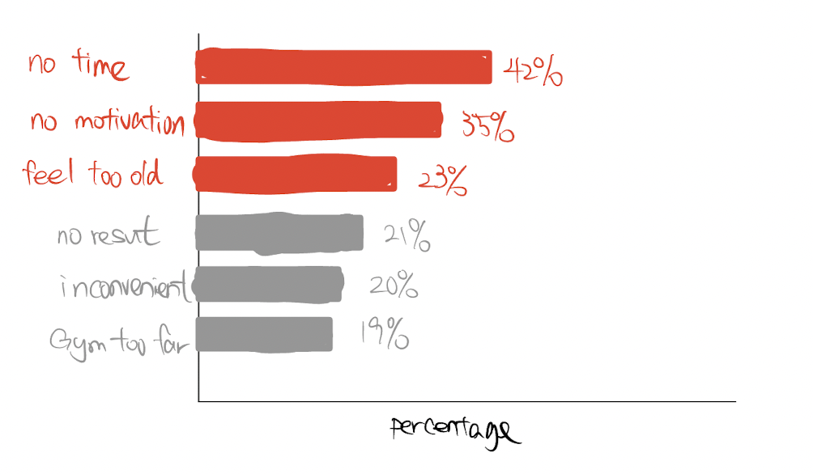

| [Home Page](https://yicenma.github.io/tswd-portfolio) | [In-Class Week3](Week3-in-class.md) |  [Visualizing Debt](visualizing-government-debt) | [Critique by Design](critique-by-design) | [Final project I](final-project-part-one) | [Final project II](final-project-part-two) | [Final project III](final-project-part-three) |

# Final project I -  Start Physical Activity Now

My project aims to convince people to adopt physical activity as a regular habit in their lives. I want to do this because recently I started to do physical activity and I am surprised by the benefits to my body and psychological side. The objective is to raise awareness of the benefits of exercise and encourage people to incorporate it into their daily routines. This could involve educating people about the positive effects of exercise on physical and mental health, as well as resolving the common reason they don’t want to exercise. The project may also include practical tips and resources to help people get started and make exercise a sustainable habit. The ultimate goal is to help people lead healthier and more fulfilling lives through regular physical activity. The primary audience would be my friends and family, CMU peers, and anyone accessing my final web page who needs the motivation to start their physical activity. And there is no limitation on the age of my target audience.

## User story and presentation structure

**Setup:**

It is a well-known fact that physical activity plays a crucial role in maintaining good health. This is a common sense approach that has been emphasized time and time again by health experts and organizations. The benefits of physical activity are numerous and well-documented, including improved cardiovascular health, stronger bones and muscles, better weight management, and enhanced mental well-being.

**Conflict:**

In today's fast-paced world, it can be easy to neglect our physical health and fall into a sedentary lifestyle. 
The increasing life expectancy implies increasing medical technology levels. The increase of obesity across the country causes people easy to neglect their physical health and more heavily depends on the medical cure.
Furthermore, I highlight the top three common reasons. Firstly, many people have demanding work schedules and long hours that leave little time for physical activity. Technology has made it easier to be sedentary, with many people spending hours sitting in front of computers or staring at their phones. They thought they don’t have time to do physical activity. Secondly, some people may simply lack motivation or struggle with finding activities that they enjoy.  Finally, some people think they are old and not fit to do exercise.

**Resolution:** 

I understand that finding time for exercise, maintaining motivation, and feeling too old are common obstacles that prevent people from incorporating physical activity into their lives. However, I firmly believe that these challenges can be overcome. I provide each solution for these three reasons. I
In reality, all you need is 30 minutes of exercise every day. This brings up the simplicity and accessibility of incorporating physical activity into one's daily routine. 30 minutes is a manageable and achievable amount of time that can make a significant impact on one's health and well-being. Additionally, 30 minutes of exercise per day is a small investment of time that can pay off in the long run in terms of improved health and quality of life. So, if you want to lead a healthier and more fulfilling life, all you need to do is set aside 30 minutes a day for physical activity.

**Call to action:**

Start to find the proper physical exercise time and activity for different ages and start following the exercise tutorial.

## Story Arc

## Story Arc

# Initial sketches

## Setup

In this visualization, I want to highlight the common sense knowledge, that physical activity plays a crucial role in maintaining good health. The flashing increasing number will illustrate this well-known fact. 

## Conflict

### Prevalence of physical inactivity overall and Prevalence of physical inactivity across all states

These two visualizations want to highlight the percentage of physical inactivity in the US and across each state in the world map.

### Obesity Rate And Life expectation From 1999

I put three lines in one chart(life expectation, obesity, and severe obesity ate) to illustrate the trend across time and focus on the trend comparison which illustrates people easy to neglect their physical health and more heavily dependent on the medical cure.

## Heart Disease

I want to highlight there is 655,000 American die from heart disease each year and 1 in every 4 dies from cardiovascular disease in the United States to make the audience feel the severity of heart disease.

### Ranking reasons for not doing physical activity

I only focus on the top three reasons for future discussion and use red to highlight them. The descending order points out the importance of those reasons. By capturing the top reasons, the result will be much more efficient.

## Resolution:

### Waste time distribution daily in hours

This visualization will highlight the percentage of wasted time in the pie chart. Most people are wasting a lot of time, which illustrates they have time. It conflicts and provides a solution for the first reason. Also, I will add the color legend on the side in the future.

### How Americans would feel if they exercised regularly
I built a word cloud of the top 10 feelings of Americans if they exercised regularly and assign the phrase weight to the percentages. These words represent the positive feelings and benefits that are often associated with regular exercise. By exercising regularly, people tend to feel more energized, happier, and less tried. They also experience physical benefits, such as improved health and strength.

## Call to Action:

I use the scatter plot to encode data using the position of times per week(y-axis) and activity intensity(x-axis) to illustrate activity requirements for each category population, so they know the corresponding activity to choose for the audience action. 

## Image Reference:

https://www.cdc.gov/physicalactivity/data/inactivity-prevalence-maps/index.html
https://www.spreadsheetweb.com/pie-chart-in-excel/

# The Data

## Data Source 1 Centers for Disease Control and Prevention (CDC)

### Link1: https://www.cdc.gov/physicalactivity/basics/pa-health/index.htm

This page provides information about the importance of physical activity for health. The page provides a comprehensive overview of the many benefits of physical activity, including improved cardiovascular health, stronger bones and muscles, better weight management, reduced risk of chronic diseases such as diabetes and some cancers, and improved mental health and well-being. The page also includes recommendations for physical activity, guidelines for different age groups, and links for getting started with a physical activity program. 

### Link2: https://www.cdc.gov/physicalactivity/data/inactivity-prevalence-maps/index.html

This data provides information on physical inactivity in the United States. The page includes maps and data showing the prevalence of physical inactivity by state and territory, as well as information on disparities in physical inactivity among different racial/ethnic and socio-economic groups. This page’s data provide valuable insights into the current state of physical inactivity in the United States and better understand the trends and disparities in physical inactivity. 

### Link3: https://www.cdc.gov/nchs/data/databriefs/db360_tables-508.pdf#page=4

It shows a table of the prevalence of obesity and severe obesity among adults in the United States(aged 20 and over) from 19999 to 2018.

### Link4:https://www.cdc.gov/heartdisease/facts.htm#:~:text=Heart%20disease%20is%20the%20leading,1%20in%20every%204%20deaths.

This page provides data and statistics on heart disease, including its prevalence, causes, and risk factors. It also provides information on the relationship between heart disease and other health behaviors, such as physical activity, diet, and smoking. The page also includes information on the steps people can take to reduce their risk of heart disease, such as maintaining a healthy lifestyle, managing risk factors, and seeking regular medical care.

## Data Source 2 New York Post Article

Link: https://nypost.com/2019/01/13/this-is-why-most-americans-dont-exercise-more/

This article published by the New York Post provides information on why many Americans do not exercise regularly. The article cites various reasons for this, including lack of time, lack of motivation, and lack of access to suitable exercise facilities. The article also touches on some of the common excuses people use for not exercising, such as being too busy or too tired. Additionally, the article provides information on the health benefits of regular exercise and encourages people to find ways to make physical activity a part of their daily routine. 

## Data Source 3 Our World in Data

Link: https://ourworldindata.org/life-expectancy#twice-as-long-life-expectancy-around-the-world

It provides information on life expectancy around the world. The page includes interactive visualizations and data on life expectancy trends over time and across different countries and regions. It also provides information on the factors that influence life expectancy, including health behaviors such as physical activity, diet, and smoking, as well as broader societal factors such as income, education, and healthcare access. The information on this page provides a comprehensive overview of life expectancy trends.

## Data Source 4 Building Indiana Article

Link: https://buildingindiana.com/we-waste-a-lot-time-and-money/#:~:text=31%25%20of%20people%20waste%20roughly,waste%20roughly%203%20hours%20daily

It discusses how people waste a lot of time and money. The post states the percentage of people who waste hours daily on activities that do not add value to their lives, such as browsing social media, watching TV, or playing video games. The post also discusses how this wasted time and money can impact an individual's physical and financial health, as well as their overall well-being. The post concludes by suggesting that people can improve their lives by reducing the amount of time they waste on non-essential activities and instead focusing on activities that add value, such as exercising, reading, or pursuing hobbies. 

## Data Source 5 Techjury Article

Link: https://techjury.net/blog/time-spent-on-social-media/#gref

It provides information on the amount of time people spend on social media. The post highlights the growing trend of social media usage and the increasing amount of time that people are spending on various social media platforms. The post provides data and statistics on the average time people spend on social media, as well as the demographic breakdown of social media users. The post also discusses the potential impact of excessive social media usage on individuals, including decreased physical activity levels, reduced sleep quality, and increased levels of stress and anxiety. The post concludes by offering tips for reducing social media usage and maximizing the benefits of using these platforms. 

## Data Source 6 Techjury Article

Link: https://techjury.net/blog/time-spent-on-social-media/#gref

It provides information on the amount of time people spend on social media. The post highlights the growing trend of social media usage and the increasing amount of time that people are spending on various social media platforms. The post provides data and statistics on the average time people spend on social media, as well as the demographic breakdown of social media users. The post also discusses the potential impact of excessive social media usage on individuals, including decreased physical activity levels, reduced sleep quality, and increased levels of stress and anxiety. The post concludes by offering tips for reducing social media usage and maximizing the benefits of using these platforms. 

# Method and Medium

I am going to polish my visualizations and try different visualization and select the best viz to make the final story be engaging and clear. 

## 1. Storytelling platform
I will use Shorthand to develop my data storytelling platform because it could create engaging and interactive content websites and personalize them in my own format. For example, I will use interactive elements and visuals to increase engagement and improve storytelling. Moreover, I use blocks to construct and differentiate the sequential of my story.

## 2. Visualization Tools
I will use two visualization tools in my project. Both Flourish and Tableau can embed into my storytelling platform.

**Flourish:** I decided to use flourish to generate most of my visualization because it can fulfill the expectation based on my draft.

**Tableau:** If the Flourish cannot fulfill the expectation, I will use Tableau to create, because it is more personalized and complex than the flourish.
I will also cite all my reference(data and images) with the website link as my media.

## 3. Call to Action

I will ask my audience to view the corresponding group’s activity time and activity intensity. Also, I will provide one video streaming workout plan for my audience.

**Web and Youtube Video: **

https://www.cdc.gov/physicalactivity/basics/age-chart.html

https://www.cdc.gov/physicalactivity/basics/adding-pa/index.htm

https://luzmod.com/

